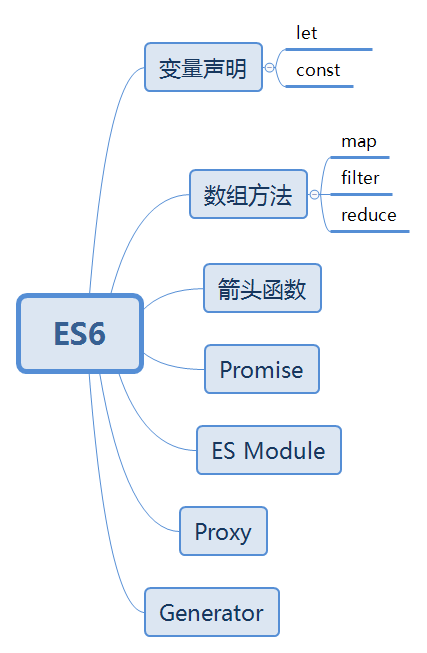

# ES6



### var、let 及 const 区别？
 - 全局申明的var变量会挂载在window上，而let和const不会
 - var声明变量存在变量提升，let和const不会
 - let、const 的作用范围是块级作用域，而var的作用范围是函数作用域
 - 同一作用域下let和const不能声明同名变量，而var可以
 - 同一作用域下在let和const声明前使用会存在暂时性死区
 - const
   - 一旦声明必须赋值,不能使用null占位
   - 声明后不能再修改
   - 如果声明的是复合类型数据，可以修改其属性


### Proxy
 Proxy 是 ES6 中新增的功能，它可以用来自定义对象中的操作。 Vue3.0 中将会通过 Proxy 来替换原本的 Object.defineProperty 来实现数据响应式。
```js
let p = new Proxy(target, handler)
```
`target` 代表需要添加代理的对象，`handler` 用来自定义对象中的操作，比如可以用来自定义 set 或者 get 函数。

```js
let onWatch = (obj, setBind, getLogger) => {
  let handler = {
    set(target, property, value, receiver) {
      setBind(value, property)
      return Reflect.set(target, property, value)
    },
    get(target, property, receiver) {
      getLogger(target, property)
      return Reflect.get(target, property, receiver)
    }
  }
  return new Proxy(obj, handler)
}

let obj = { a: 1 }
let p = onWatch(
  obj,
  (v, property) => {
    console.log(`监听到属性${property}改变为${v}`)
  },
  (target, property) => {
    console.log(`'${property}' = ${target[property]}`)
  }
)
p.a = 2 // 控制台输出：监听到属性a改变
p.a // 'a' = 2
```
自定义 set 和 get 函数的方式，在原本的逻辑中插入了我们的函数逻辑，实现了在对对象任何属性进行读写时发出通知。

当然这是简单版的响应式实现，如果需要实现一个 Vue 中的响应式，需要我们在 get 中收集依赖，在 set 派发更新，之所以 Vue3.0 要使用 Proxy 替换原本的 API 原因在于 Proxy 无需一层层递归为每个属性添加代理，一次即可完成以上操作，性能上更好，并且原本的实现有一些数据更新不能监听到，但是 Proxy 可以完美监听到任何方式的数据改变，唯一缺陷可能就是浏览器的兼容性不好了。


### map
map 作用是生成一个新数组，遍历原数组，将每个元素拿出来做一些变换然后返回一个新数组，原数组不发生改变。

map 的回调函数接受三个参数，分别是当前索引元素，索引，原数组
```js
var arr = [1,2,3];
var arr2 = arr.map(item => item + 1)    
arr   //[ 1, 2, 3 ]
arr2  // [ 2, 3, 4 ]
```

```js
['1','2','3'].map(parseInt)
// -> [ 1, NaN, NaN ]
```
 - 第一个 parseInt('1', 0) -> 1
 - 第二个 parseInt('2', 1) -> NaN
 - 第三个 parseInt('3', 2) -> NaN


### filter
filter 的作用也是生成一个新数组，在遍历数组的时候将返回值为 true 的元素放入新数组，我们可以利用这个函数删除一些不需要的元素

filter 的回调函数接受三个参数，分别是当前索引元素，索引，原数组


### reduce
reduce 可以将数组中的元素通过回调函数最终转换为一个值。
如果我们想实现一个功能将函数里的元素全部相加得到一个值，可能会这样写代码
```js
const arr = [1, 2, 3]
let total = 0
for (let i = 0; i < arr.length; i++) {
  total += arr[i]
}
console.log(total) //6 
```
但是如果我们使用 reduce 的话就可以将遍历部分的代码优化为一行代码
```js
const arr = [1, 2, 3]
const sum = arr.reduce((acc, current) => acc + current, 0)
console.log(sum)
```
对于 reduce 来说，它接受两个参数，分别是回调函数和初始值，接下来我们来分解上述代码中 reduce 的过程
 - 首先初始值为 0，该值会在执行第一次回调函数时作为第一个参数传入
 - 回调函数接受四个参数，分别为累计值、当前元素、当前索引、原数组，后三者想必大家都可以明白作用，这里着重分析第一个参数
 - 在一次执行回调函数时，当前值和初始值相加得出结果 1，该结果会在第二次执行回调函数时当做第一个参数传入
 - 所以在第二次执行回调函数时，相加的值就分别是 1 和 2，以此类推，循环结束后得到结果 6。


### Es6中箭头函数与普通函数的区别？
 - 普通function的声明在变量提升中是最高的，箭头函数没有函数提升
 - 箭头函数没有属于自己的this，arguments
 - 箭头函数不能作为构造函数，不能被new，没有property
 - call和apply方法只有参数，没有作用域


### Promise
`Promise` 翻译过来就是承诺的意思，这个承诺会在未来有一个确切的答复，并且该承诺有三种状态，这个承诺一旦从等待状态变成为其他状态就永远不能更改状态了。

 - 等待中（pending）
 - 完成了（resolved）
 - 拒绝了（rejected）

当我们在构造 Promise 的时候，构造函数内部的代码是立即执行的。
```js
new Promise((resolve, reject) => {
  console.log('new Promise')
  resolve('success')
})
console.log('finifsh')

// 先打印new Promise， 再打印 finifsh
```

Promise 实现了链式调用，也就是说每次调用 then 之后返回的都是一个 Promise，并且是一个全新的 Promise，原因也是因为状态不可变。如果你在 then 中 使用了 return，那么 return 的值会被 Promise.resolve() 包装。
```js
Promise.resolve(1)
  .then(res => {
    console.log(res) // => 1
    return 2 // 包装成 Promise.resolve(2)
  })
  .then(res => {
    console.log(res) // => 2
  })
```

当然了，Promise 也很好地解决了回调地狱的问题
```js
ajax(url)
  .then(res => {
      console.log(res)
      return ajax(url1)
  }).then(res => {
      console.log(res)
      return ajax(url2)
  }).then(res => console.log(res))
```
其实它也是存在一些缺点的，比如无法取消 Promise，错误需要通过回调函数捕获。


### async 和 await

一个函数如果加上 async ，那么该函数就会返回一个 Promise
```js
async function test() {
  return "1"
}
console.log(test()) 
// -> Promise {<resolved>: "1"}
```

async 就是将函数返回值使用 Promise.resolve() 包裹了下，和 then 中处理返回值一样，并且 await 只能配套 async 使用。
```js
async function test() {
  let value = await sleep()
}
```
async 和 await 可以说是异步终极解决方案了，相比直接使用 Promise 来说，优势在于处理 then 的调用链，能够更清晰准确的写出代码，毕竟写一大堆 then 也很恶心，并且也能优雅地解决回调地狱问题。

当然也存在一些缺点，因为 **await 将异步代码改造成了同步代码**，如果多个异步代码没有依赖性却使用了 await 会导致性能上的降低。
```js
async function test() {
  // 以下代码没有依赖性的话，完全可以使用 Promise.all 的方式
  // 如果有依赖性的话，其实就是解决回调地狱的例子了
  await fetch(url)
  await fetch(url1)
  await fetch(url2)
}
```

看一个使用 await 的例子：
```js
let a = 0
let b = async () => {
  a = a + await 10
  console.log('2', a)
}
b()
a++
console.log('1', a)

//先输出  ‘1’, 1
//在输出  ‘2’, 10
```
 - 首先函数 b 先执行，在执行到 await 10 之前变量 a 还是 0，因为 await 内部实现了 generator ，generator 会保留堆栈中东西，所以这时候 a = 0 被保存了下来
 - 因为 await 是异步操作，后来的表达式不返回 Promise 的话，就会包装成 Promise.reslove(返回值)，然后会去执行函数外的同步代码
 - 同步代码 a++ 与打印 a 执行完毕后开始执行异步代码，将保存下来的值拿出来使用，这时候 a = 0 + 10


上述解释中提到了 await 内部实现了 generator，其实 **await 就是 generator 加上 Promise 的语法糖，且内部实现了自动执行 generator**。


### Generator 生成器

```js
function *foo(x) {
  let y = 2 * (yield (x + 1))
  let z = yield (y / 3)
  return (x + y + z)
}
let it = foo(5)
console.log(it.next())   // => {value: 6, done: false}
console.log(it.next(12)) // => {value: 8, done: false}
console.log(it.next(13)) // => {value: 42, done: true}
```

 - 首先 Generator 函数调用和普通函数不同，它会返回一个迭代器

 - 当执行第一次 next 时，传参会被忽略，并且函数暂停在 yield (x + 1) 处，所以返回 5 + 1 = 6

 - 当执行第二次 next 时，传入的参数等于上一个 yield 的返回值，如果你不传参，yield 永远返回 undefined。此时 let y = 2 * 12，所以第二个 yield 等于 2 * 12 / 3 = 8

 - 当执行第三次 next 时，传入的参数会传递给 z，所以 z = 13, x = 5, y = 24，相加等于 42


### 生成器原理

当yeild产生一个值后，生成器的执行上下文就会从栈中弹出。但由于迭代器一直保持着队执行上下文的引用，上下文不会丢失，不会像普通函数一样执行完后上下文就被销毁


### ES Module
ES Module 是原生实现的模块化方案，与 CommonJS 有以下几个区别

 - CommonJS 支持动态导入，也就是 require(${path}/xx.js)，后者目前不支持，但是已有提案
 - CommonJS 是同步导入，因为用于服务端，文件都在本地，同步导入即使卡住主线程影响也不大。而后者是异步导入，因为用于浏览器，需要下载文件，如果也采用同步导入会对渲染有很大影响
 - CommonJS 在导出时都是值拷贝，就算导出的值变了，导入的值也不会改变，所以如果想更新值，必须重新导入一次。但是 ES Module 采用实时绑定的方式，导入导出的值都指向同一个内存地址，所以导入值会跟随导出值变化
 - ES Module 会编译成 require/exports 来执行的

```js
// 引入模块 API
import XXX from './a.js'
import { XXX } from './a.js'
// 导出模块 API
export function a() {}
export default function() {}
```


### 私有方法和私有属性（阿里一面）

[阮老师 | ES6入门](https://es6.ruanyifeng.com/?search=%E7%A7%81%E6%9C%89&x=0&y=0#docs/class#%E7%A7%81%E6%9C%89%E6%96%B9%E6%B3%95%E5%92%8C%E7%A7%81%E6%9C%89%E5%B1%9E%E6%80%A7)


#### 现有的解决方案

私有方法和私有属性，是只能在类的内部访问的方法和属性，外部不能访问。这是常见需求，有利于代码的封装，但 ES6 不提供，只能通过变通方法模拟实现。

一种做法是在命名上加以区别，即在函数名或属性名前加`_`，但这并不安全，只是一种团队规范。

另一种方法就是索性**将私有方法移出类，放到模块里**，因为模块内部的所有方法都是对外可见的。
```js
class Widget {
  foo (baz) {
    bar.call(this, baz);
  }

  // ...
}

function bar(baz) {
  return this.snaf = baz;
}
```
上面代码中，foo是公开方法，内部调用了bar.call(this, baz)。这使得bar实际上成为了当前模块的私有方法。


还有一种方法是利用**Symbol值的唯一性**，将私有方法的名字命名为一个Symbol值。
```js
const bar = Symbol('bar');
const snaf = Symbol('snaf');

export default class myClass{

  // 公有方法
  foo(baz) {
    this[bar](baz);
  }

  // 私有方法
  [bar](baz) {
    return this[snaf] = baz;
  }

  // ...
};
```

上面代码中，bar和snaf都是Symbol值，一般情况下无法获取到它们，因此达到了私有方法和私有属性的效果。但是也不是绝对不行，Reflect.ownKeys()依然可以拿到它们。

```js
const inst = new myClass();

Reflect.ownKeys(myClass.prototype)
// [ 'constructor', 'foo', Symbol(bar) ]
```
