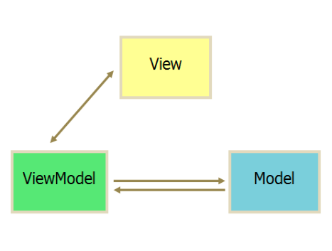
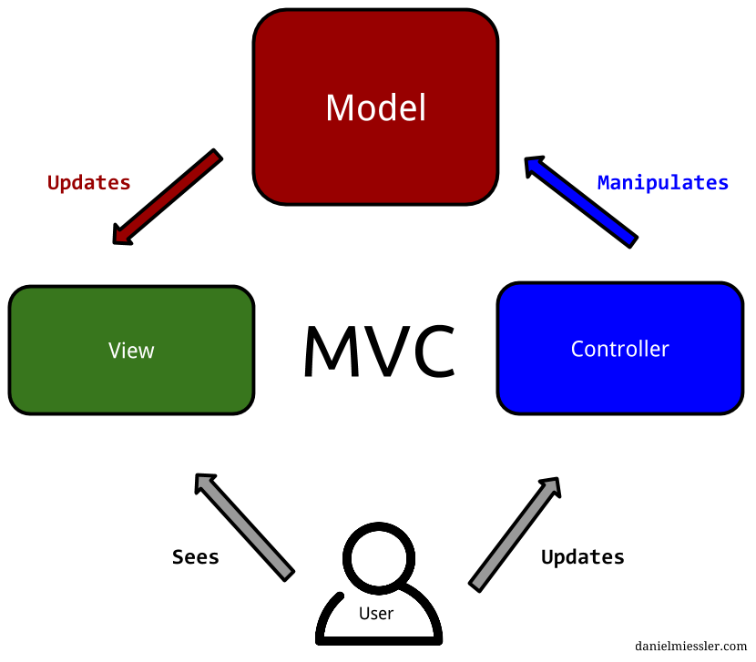

### v-bind和v-model的区别
- v-bind用来绑定数据和属性以及表达式，缩写为 :
- v-model使用在表单中，实现双向数据绑定的，在表单元素外使用不起作用。

v-bind

1.绑定文本  直接用v-bind或者{{}}
```js
<p v-bind="message"></p>
<p>{{message}}</p>
```
2.绑定属性
```js
<p v-bind:src="http://...."></p>
<p v-bind:class="http://...."></p>
<p v-bind:style="http://...."></p>
```
3.绑定表达式
```js
{{ number + 1 }}
{{ ok ? 'YES' : 'NO' }}
{{ message.split('').reverse().join('') }}
```
4.绑定html 这个时候必须要使用三个{}
```js
<div>{{{ raw_html }}}</div>
```

v-model  多在表单中使用，在表单元素上创建双向绑定，根据控件类型选择正确的方法更新元素，可以绑定text、radio、checkbox、selected

1.绑定text
```js
<input type="text" v-model="val" />
<p> {{val}} </p>
```
2.绑定radio  radioval的值随着选择单选框的值，会变成one 或者 two
```js
<input type="radio" value="one" v-model="radioVal" />
<input type="radio" value="two" v-model="radioVal" />
<label for v-bind="radioval" />
```

### 什么是 mvvm？


MVVM 是 Model-View-ViewModel 的缩写。mvvm 是一种设计思想。Model 层代表数据模型，也可以在 Model 中定义数据修改和操作的业务逻辑；View 代表 UI 组件，它负责将数据模型转化成 UI 展现出来，ViewModel 是一个同步 View 和 Model 的对象。

在 MVVM 架构下，View 和 Model 之间并没有直接的联系，而是通过 ViewModel 进行交互，Model 和 ViewModel 之间的交互是双向的， 因此 View 数据的变化会同步到 Model 中，而 Model 数据的变化也会立即反应到 View 上。

ViewModel 通过双向数据绑定把 View 层和 Model 层连接了起来，而 View 和 Model 之间的同步工作完全是自动的，无需人为干涉，因此开发者只需关注业务逻辑，不需要手动操作 DOM, 不需要关注数据状态的同步问题，复杂的数据状态维护完全由 MVVM 来统一管理。

### mvvm 和 mvc 区别？


mvc 和 mvvm 其实区别并不大。都是一种设计思想。主要就是 mvc 中 Controller 演变成 mvvm 中的 viewModel。mvvm 主要解决了 mvc 中大量的 DOM 操作使页面渲染性能降低，加载速度变慢，影响用户体验。和当 Model 频繁发生变化，开发者需要主动更新到 View 。

### vue 的优点是什么？

- 低耦合。视图（View）可以独立于 Model 变化和修改，一个 ViewModel 可以绑定到不同的"View"上，当 View 变化的时候 Model 可以不变，当 Model 变化的时候 View 也可以不变。
- 可重用性。你可以把一些视图逻辑放在一个 ViewModel 里面，让很多 view 重用这段视图逻辑。
- 独立开发。开发人员可以专注于业务逻辑和数据的开发（ViewModel），设计人员可以专注于页面设计，使用 Expression Blend 可以很容易设计界面并生成 xml 代码。
- 可测试。界面素来是比较难于测试的，而现在测试可以针对 ViewModel 来写。

### 请详细说下你对 vue 生命周期的理解？
    总共分为 8 个阶段创建前/后，载入前/后，更新前/后，销毁前/后。

- 创建前/后： 在 beforeCreate 阶段，vue 实例的挂载元素 el 还没有。
- 载入前/后：在 beforeMount 阶段，vue 实例的$el 和 data 都初始化了，但还是挂载之前为虚拟的 dom 节点，data.message 还未替换。在 mounted 阶段，vue 实例挂载完成，data.message 成功渲染。
- 更新前/后：当 data 变化时，会触发 beforeUpdate 和 updated 方法。
- 销毁前/后：在执行 destroy 方法后，对 data 的改变不会再触发周期函数，说明此时 vue 实例已经解除了事件监听以及和 dom 的绑定，但是 dom 结构依然存在


### 组件之间的传值？

1. 父组件与子组件传值

```html
//父组件通过标签上面定义传值 
<template>
    <Main :obj="data"></Main>
</template>
<script>
    //引入子组件
    import Main form "./main"

    exprot default{
        name:"parent",
        data(){
            return {
                data:"我要向子组件传递数据"
            }
        },
        //初始化组件
        components:{
            Main
        }
    }
</script>


//子组件通过props方法接受数据
<template>
    <div>{{data}}</div>
</template>
<script>
    exprot default{
        name:"son",
        //接受父组件传值
        props:["data"]
    }
</script>
```

2. 子组件向父组件传递数据

```html
//子组件通过$emit方法传递参数
<template>
   <div v-on:click="events"></div>
</template>
<script>
    //引入子组件
    import Main form "./main"

    exprot default{
        methods:{
            events:function(){

            }
        }
    }
</script>


//

<template>
    <div>{{data}}</div>
</template>
<script>
    exprot default{
        name:"son",
        //接受父组件传值
        props:["data"]
    }
</script>
```
3. 通过eventBus传值

4. 通过Vuex传值


### active-class 是哪个组件的属性？如何使用？

    active-class是vue-router模块的router-link组件中的属性，用来做选中样式的切换

在vue-router中要使用active-class有两种方法：

- 第一种
在router-link中写入active-class，active-class选择样式时根据路由中的路径（to=“/home”）去匹配，然后显示。
```js
<router-link to="/home" class="menu-home" active-class="active">首页</router-link>
```
- 第二种
直接在路由js文件中配置linkActiveClass
```js
export default new Router({
  linkActiveClass: 'active',
})

<div class="menu-btn">
  <router-link to="/" class="menu-home" active-class="active">
    首页
  </router-link>
</div>
<div class="menu-btn">
  <router-link to="/my" class="menu-my" active-class="active">
    我的
  </router-link>
</div>
```

### 嵌套路由怎么定义？

在实际项目中我们会碰到多层嵌套的组件组合而成，但是我们如何实现嵌套路由呢？因此我们需要在 VueRouter 的参数中使用 children 配置，这样就可以很好的实现路由嵌套。
index.html，只有一个路由出口

```html
<div id="app">
    <!-- router-view 路由出口, 路由匹配到的组件将渲染在这里 -->
    <router-view></router-view>
</div>
```

main.js，路由的重定向，就会在页面一加载的时候，就会将 home 组件显示出来，因为重定向指向了 home 组件，redirect 的指向与 path 的必须一致。children 里面是子路由，当然子路由里面还可以继续嵌套子路由。

```js
import Vue from 'vue'
import VueRouter from 'vue-router'
Vue.use(VueRouter)

//引入两个组件

import home from "./home.vue"
import game from "./game.vue"
//定义路由
const routes = [
    { path: "/", redirect: "/home" },//重定向,指向了home组件
    {
        path: "/home", component: home,
        children: [
            { path: "/home/game", component: game }
        ]
    }
]
//创建路由实例
const router = new VueRouter({routes})

new Vue({
    el: '#app',
    data: {
    },
    methods: {
    },
    router
})
```

home.vue，点击显示就会将子路由显示在出来，子路由的出口必须在父路由里面，否则子路由无法显示。

### 路由之间跳转？

- 声明式（标签跳转） `<router-link :to="index">`
- 编程式（ js 跳转） `router.push('index')`


### 懒加载（按需加载路由）（常考）

webpack 中提供了 require.ensure()来实现按需加载。以前引入路由是通过 import 这样的方式引入，改为 const 定义的方式进行引入。

- 不进行页面按需加载引入方式：

```js
import  home   from '../../common/home.vue'
```

- 进行页面按需加载的引入方式：

```js
const  home = r => require.ensure( [], () => r (require('../../common/home.vue')))
```

### vue-router 有哪几种导航钩子?

三种

- 全局导航钩子
  - router.beforeEach(to, from, next),
  - router.beforeResolve(to, from, next),
  - router.afterEach(to, from ,next)
- 组件内钩子
  - beforeRouteEnter,
  - beforeRouteUpdate,
  - beforeRouteLeave
- 单独路由独享组件
  - beforeEnter

### 自定义指令(v-check, v-focus) 的方法有哪些? 它有哪些钩子函数? 还有哪些钩子函数参数

- 全局定义指令：在 vue 对象的 directive 方法里面有两个参数, 一个是指令名称, 另一个是函数。
- 组件内定义指令：directives
- 钩子函数: bind(绑定事件出发)、inserted(节点插入时候触发)、update(组件内相关更新)
- 钩子函数参数： el、binding

### 说出至少 4 种 vue 当中的指令和它的用法

v-if(判断是否隐藏)、v-for(把数据遍历出来)、v-bind(绑定属性)、v-model(实现双向绑定)

### vue 的双向绑定的原理是什么(常考)

vue.js 是采用数据劫持结合发布者-订阅者模式的方式，通过 Object.defineProperty()来劫持各个属性的 setter，getter，在数据变动时发布消息给订阅者，触发相应的监听回调。

具体步骤：
第一步：需要 observe 的数据对象进行递归遍历，包括子属性对象的属性，都加上 setter 和 getter 这样的话，给这个对象的某个值赋值，就会触发 setter，那么就能监听到了数据变化

第二步：compile 解析模板指令，将模板中的变量替换成数据，然后初始化渲染页面视图，并将每个指令对应的节点绑定更新函数，添加监听数据的订阅者，一旦数据有变动，收到通知，更新视图

第三步：Watcher 订阅者是 Observer 和 Compile 之间通信的桥梁，主要做的事情是:

- 在自身实例化时往属性订阅器(dep)里面添加自己
- 自身必须有一个 update()方法
- 待属性变动 dep.notice()通知时，能调用自身的 update() 方法，并触发 Compile 中绑定的回调，则功成身退。

第四步：MVVM 作为数据绑定的入口，整合 Observer、Compile 和 Watcher 三者，通过 Observer 来监听自己的 model 数据变化，通过 Compile 来解析编译模板指令，最终利用 Watcher 搭起 Observer 和 Compile 之间的通信桥梁，达到数据变化 -> 视图更新；视图交互变化(input) -> 数据 model 变更的双向绑定效果。

据资料，vue3.0将会使用proxy代替object.defineproperty

## vuex 相关
### vuex 是什么？怎么使用？哪种功能场景使用它？

vue 框架中状态管理。在 main.js 引入 store，注入。新建了一个目录 store，….. export 。场景有：单页应用中，组件之间的状态。音乐播放、登录状态、加入购物车

```js
// 新建 store.js
import vue from 'vue'
import vuex form 'vuex'
vue.use(vuex)
export default new vuex.store({
	//...code
})

//main.js
import store from './store'
...
```
### vuex 有哪几种属性

有 5 种，分别是 state、getter、mutation、action、module
>state => 基本数据 
getters => 从基本数据派生的数据 
mutations => 提交更改数据的方法，同步！ 
actions => 像一个装饰器，包裹mutations，使之可以异步。 
modules => 模块化Vuex

### vuex 的 store 特性是什么

- vuex 就是一个仓库，仓库里放了很多对象。其中 state 就是数据源存放地，对应于一般 vue 对象里面的 data
- state 里面存放的数据是响应式的，vue 组件从 store 读取数据，若是 store 中的数据发生改变，依赖这相数据的组件也会发生更新
- 它通过 mapState 把全局的 state 和 getters 映射到当前组件的 computed 计算属性

### vuex 的 state 特性是什么
- Vuex使用单一状态树，即用一个对象就包含了全部的状态数据。state作为构造器选项，定义了所有我们需要的基本状态参数。
- 我们可以通过Vue的Computed获得Vuex的state，如下：
```js
const store = new Vuex.Store({
    state: {
        count:0
    }
})
const app = new Vue({
    //..
    store,
    computed: {
        count: function(){
            return this.$store.state.count
        }
    },
    //..
})
```
每当 store.state.count 变化的时候, 都会重新求取计算属性，并且触发更新相关联的 DOM。
### vuex 的 getter 特性是什么

- getter 可以对 state 进行计算操作，它就是 store 的计算属性
- 虽然在组件内也可以做计算属性，但是 getters 可以在多给件之间复用
- 如果一个状态只在一个组件内使用，是可以不用 getters
```js
const store = new Vuex.Store({
    state: {
        count:0
    }，
    getters: {
        // 单个参数
        countDouble: function(state){
            return state.count * 2
        },
        // 两个参数
        countDoubleAndDouble: function(state, getters) {
            return getters.countDouble * 2
        }
    }
})
```

### vuex 的 mutations 特性是什么

- 提交mutation是更改Vuex中的store中的状态的唯一方法。
- mutation必须是同步的，如果要异步需要使用action。
```js
const store = new Vuex.Store({
  state: {
    count: 1
  },
  mutations: {
    //无提交荷载
    increment(state) {
        state.count++
    }
    //提交荷载
    incrementN(state, obj) {
      state.count += obj.n
    }
  }
})
```
### vuex 的 actoion 特性是什么

action 类似于 muation, 不同在于：
- action 提交的是 mutation,而不是直接变更状态。
- action 可以包含任意异步操作。
```js
const store = new Vuex.Store({
  state: {
    count: 0
  },
  mutations: {
    increment (state) {
      state.count++
    }
  },
  actions: {
    increment (context) {
      setInterval(function(){
        context.commit('increment')
      }, 1000)
    }
  }
})
```
Action 通过 store.dispatch 方法触发：
```js
store.dispatch('increment')
```
##### 其他与mutations类似的地方
Actions 支持同样的载荷方式和对象方式进行分发：
```js
// 以载荷形式分发
store.dispatch('incrementN', {
  n: 10
})

// 以对象形式分发
store.dispatch({
  type: 'incrementN',
  n: 10
})
```
### vuex 的 Modules 特性是什么
- 使用单一状态树，导致应用的所有状态集中到一个很大的对象。但是，当应用变得很大时，store 对象会变得臃肿不堪。
- 为了解决以上问题，Vuex 允许我们将 store 分割到模块（module）。每个模块拥有自己的 state、mutation、action、getters、甚至是嵌套子模块——从上至下进行类似的分割：
```js
const moduleA = {
  state: { ... },
  mutations: { ... },
  actions: { ... },
  getters: { ... }
}

const moduleB = {
  state: { ... },
  mutations: { ... },
  actions: { ... }
}

const store = new Vuex.Store({
  modules: {
    a: moduleA,
    b: moduleB
  }
})
```

### vue 中 ajax 请求代码应该写在组件的 methods 中还是 vuex 的 action 中

如果请求来的数据不是要被其他组件公用，仅仅在请求的组件内使用，就不需要放入 vuex 的 state 里

如果被其他地方复用，请将请求放入 action 里，方便复用，并包装成 promise 返回

### 不用 vuex 会带来什么问题

- 可维护性会下降，你要修改数据，你得维护 3 个地方
- 可读性下降，因为一个组件里的数据，你根本就看不出来是从哪里来的
- 增加耦合，大量的上传派发，会让耦合性大大的增加，本来 Vue 用 Component 就是为了减少耦合，现在这么用，和组件化的初衷相背

### vuex 原理

vuex 仅仅是作为 vue 的一个插件而存在，不像 Redux,MobX 等库可以应用于所有框架，vuex 只能使用在 vue 上，很大的程度是因为其高度依赖于 vue 的 computed 依赖检测系统以及其插件系统，

vuex 整体思想诞生于 flux,可其的实现方式完完全全的使用了 vue 自身的响应式设计，依赖监听、依赖收集都属于 vue 对对象 Property set get 方法的代理劫持。最后一句话结束 vuex 工作原理，vuex 中的 store 本质就是没有 template 的隐藏着的 vue 组件；

### 使用 Vuex 只需执行 Vue.use(Vuex)，并在 Vue 的配置中传入一个 store 对象的示例，store 是如何实现注入的？[美团](https://tech.meituan.com/vuex_code_analysis.html)

Vue.use(Vuex) 方法执行的是 install 方法，它实现了 Vue 实例对象的 init 方法封装和注入，使传入的 store 对象被设置到 Vue 上下文环境的$store 中。因此在 Vue Component 任意地方都能够通过 this.$store 访问到该 store。

### state 内部支持模块配置和模块嵌套，如何实现的？[美团](https://tech.meituan.com/vuex_code_analysis.html)

在 store 构造方法中有 makeLocalContext 方法，所有 module 都会有一个 local context，根据配置时的 path 进行匹配。所以执行如 dispatch('submitOrder', payload)这类 action 时，默认的拿到都是 module 的 local state，如果要访问最外层或者是其他 module 的 state，只能从 rootState 按照 path 路径逐步进行访问。

### 在执行 dispatch 触发 action(commit 同理)的时候，只需传入(type, payload)，action 执行函数中第一个参数 store 从哪里获取的？[美团](https://tech.meituan.com/vuex_code_analysis.html)

store 初始化时，所有配置的 action 和 mutation 以及 getters 均被封装过。在执行如 dispatch('submitOrder', payload)的时候，actions 中 type 为 submitOrder 的所有处理方法都是被封装后的，其第一个参数为当前的 store 对象，所以能够获取到 { dispatch, commit, state, rootState } 等数据。

### Vuex 如何区分 state 是外部直接修改，还是通过 mutation 方法修改的？[美团](https://tech.meituan.com/vuex_code_analysis.html)

Vuex 中修改 state 的唯一渠道就是执行 commit('xx', payload) 方法，其底层通过执行 this.\_withCommit(fn) 设置\_committing 标志变量为 true，然后才能修改 state，修改完毕还需要还原\_committing 变量。外部修改虽然能够直接修改 state，但是并没有修改\_committing 标志位，所以只要 watch 一下 state，state change 时判断是否\_committing 值为 true，即可判断修改的合法性。

### 调试时的"时空穿梭"功能是如何实现的？[美团](https://tech.meituan.com/vuex_code_analysis.html)

devtoolPlugin 中提供了此功能。因为 dev 模式下所有的 state change 都会被记录下来，'时空穿梭' 功能其实就是将当前的 state 替换为记录中某个时刻的 state 状态，利用 store.replaceState(targetState) 方法将执行 this.\_vm.state = state 实现。

## axios

### axios 是什么？怎么使用？描述使用它实现登录功能的流程

axios 是请求后台资源的模块。 npm i axios -S

如果发送的是跨域请求，需在配置文件中 config/index.js 进行配置
