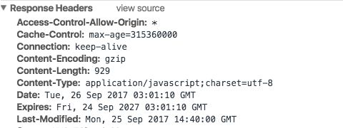
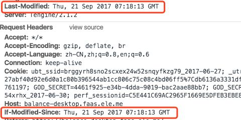
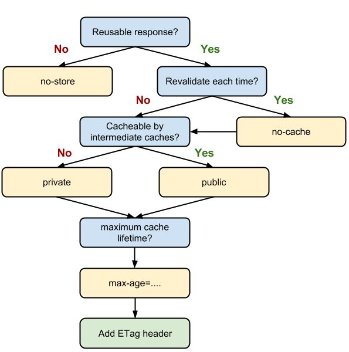

# http缓存

- Web 缓存大致可以分为：数据库缓存、服务器端缓存（代理服务器缓存、CDN 缓存）、浏览器缓存。
- 浏览器缓存也包含很多内容： HTTP 缓存、indexDB、cookie、localstorage 等等。

在具体了解 HTTP 缓存之前先来明确几个术语：

- 缓存命中率：从缓存中得到数据的请求数与所有请求数的比率。理想状态是越高越好。
- 过期内容：超过设置的有效时间，被标记为“陈旧”的内容。通常过期内容不能用于回复客户端的请求，必须重新向源服务器请求新的内容或者验证缓存的内容是否仍然准备。
- 验证：验证缓存中的过期内容是否仍然有效，验证通过的话刷新过期时间。
- 失效：失效就是把内容从缓存中移除。当内容发生改变时就必须移除失效的内容。

浏览器缓存主要是 HTTP 协议定义的缓存机制。HTML meta 标签，例如
```js
<META HTTP-EQUIV="Pragma" CONTENT="no-store">
```
含义是让浏览器不缓存当前页面。但是代理服务器不解析 HTML 内容，一般应用广泛的是用**HTTP头信息**控制缓存。

### HTTP 头信息控制缓存

大致分为两种：**强缓存**和**协商缓存**。强缓存如果命中缓存不需要和服务器端发生交互，而协商缓存不管是否命中都要和服务器端发生交互，强制缓存的优先级高于协商缓存。具体内容下文介绍。

匹配流程（已有缓存的情况下）：


### 强缓存

可以理解为无须验证的缓存策略。对强缓存来说，响应头中有两个字段 Expires/Cache-Control 来表明规则。

#### Expires

Expires 指缓存过期的时间，超过了这个时间点就代表资源过期。有一个问题是由于使用具体时间，如果时间表示出错或者没有转换到正确的时区都可能造成缓存生命周期出错。并且 Expires 是 HTTP/1.0 的标准，现在更倾向于用 HTTP/1.1 中定义的 Cache-Control。两个同时存在时也是 Cache-Control 的优先级更高。

#### Cache-Control

Cache-Control 可以由多个字段组合而成，主要有以下几个取值：

1. **max-age** 指定一个时间长度，在这个时间段内缓存是有效的，单位是s。例如设置 Cache-Control:max-age=31536000，也就是说缓存有效期为（31536000 / 24 / 60 * 60）天，第一次访问这个资源的时候，服务器端也返回了 Expires 字段，并且过期时间是一年后。



在没有禁用缓存并且没有超过有效时间的情况下，再次访问这个资源就命中了缓存，不会向服务器请求资源而是直接从浏览器缓存中取。


2. **s-maxage** 同 max-age，覆盖 max-age、Expires，但仅适用于共享缓存，在私有缓存中被忽略。

3. **public** 表明响应可以被任何对象（发送请求的客户端、代理服务器等等）缓存。

4. **private** 表明响应只能被单个用户（可能是操作系统用户、浏览器用户）缓存，是非共享的，不能被代理服务器缓存。

5. **no-cache** 强制所有缓存了该响应的用户，在使用已缓存的数据前，发送带验证器的请求到服务器。不是字面意思上的不缓存。

6. **no-store** 禁止缓存，每次请求都要向服务器重新获取数据。

### 协商缓存

缓存的资源到期了，并不意味着资源内容发生了改变，如果和服务器上的资源没有差异，实际上没有必要再次请求。客户端和服务器端通过某种验证机制验证当前请求资源是否可以使用缓存。

浏览器第一次请求数据之后会将数据和响应头部的缓存标识存储起来。再次请求时会带上存储的头部字段，服务器端验证是否可用。如果返回 304 Not Modified，代表资源没有发生改变可以使用缓存的数据，获取新的过期时间。反之返回 200 就相当于重新请求了一遍资源并替换旧资源。

#### Last-modified/If-Modified-Since

Last-modified: 服务器端资源的最后修改时间，响应头部会带上这个标识。第一次请求之后，浏览器记录这个时间，再次请求时，请求头部带上 If-Modified-Since 即为之前记录下的时间。服务器端收到带 If-Modified-Since 的请求后会去和资源的最后修改时间对比。若修改过就返回最新资源，状态码 200，若没有修改过则返回 304。



**注意**：如果响应头中有 Last-modified 而没有 Expire 或 Cache-Control 时，浏览器会有自己的算法来推算出一个时间缓存该文件多久，不同浏览器得出的时间不一样，所以 Last-modified 要记得配合 Expires/Cache-Control 使用。

#### Etag/If-None-Match

由服务器端上生成的一段 hash 字符串，第一次请求时响应头带上 ETag: abcd，之后的请求中带上 If-None-Match: abcd，服务器检查 ETag，返回 304 或 200。


关于 last-modified 和 Etag 区别，已经有很多人总结过了：

- 某些服务器不能精确得到资源的最后修改时间，这样就无法通过最后修改时间判断资源是否更新。
- Last-modified 只能精确到秒。
- 一些资源的最后修改时间改变了，但是内容没改变，使用 Last-modified 看不出内容没有改变。
- Etag 的精度比 Last-modified 高，属于强验证，要求资源字节级别的一致，优先级高。如果服务器端有提供 ETag 的话，必须先对 ETag 进行 Conditional Request。

**注意**：实际使用 ETag/Last-modified 要注意保持一致性，做负载均衡和反向代理的话可能会出现不一致的情况。计算 ETag 也是需要占用资源的，如果修改不是过于频繁，看自己的需求用 Cache-Control 是否可以满足。

### 选择 Cache-Control 的策略（摘自 Google Developers）



### 实际应用

回到实际应用上来，首先要明确哪些内容适合被缓存哪些不适合。

考虑缓存的内容：

- css样式文件
- js文件
- logo、图标
- html文件
- 可以下载的内容

一些不应该被缓存的内容：

- 业务敏感的 GET 请求

#### 可缓存的内容又分为几种不同的情况：

给 max-age 设置一个较大的值，一般设置 max-age=31536000

比如引入的一些第三方文件、打包出来的带有 hash 后缀 css、js 文件。一般来说文件内容改变了，会更新版本号、hash 值，相当于请求另一个文件。

标准中规定 max-age 的值最大不超过一年，所以设成 max-age=31536000。至于过期内容，缓存区会将一段时间没有使用的文件删除掉。

#### 可能经常需要变动的文件:

Cache-Control: no-cache / max-age=0

比如入口 index.html 文件、文件内容改变但名称不变的资源。选择 ETag 或 Last-Modified 来做验证，在使用缓存资源之前一定会去服务器端做验证，命中缓存时会比第一种情况慢一点点，毕竟还要发请求进行通信。