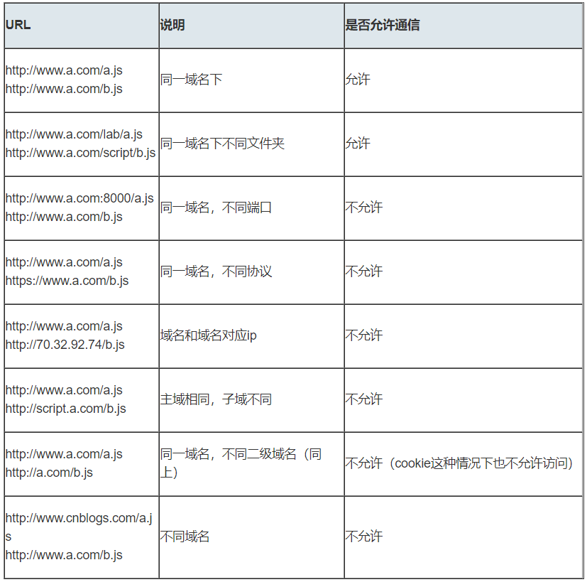

# 九种跨域方式实现原理

### 什么是跨域？

- 什么是同源策略及其限制内容？

同源策略是一种约定，它是浏览器最核心也最基本的安全功能，如果缺少了同源策略，浏览器很容易受到XSS、CSFR等攻击。所谓同源是指”协议+域名+端口”三者相同，即便两个不同的域名指向同一个ip地址，也非同源。

同源策略限制内容有：

- Cookie、LocalStorage、IndexedDB 等存储性内容
- DOM 节点
- AJAX 请求发送后，结果被浏览器拦截了

但是有三个标签是允许跨域加载资源:

- ``
- `<link href=XXX>`
- `<script src=XXX>`

### 常见跨域场景:

当协议、子域名、主域名、端口号中任意一个不相同时，都算作不同域。

不同域之间相互请求资源，就算作“跨域”。常见跨域场景如下图所示：

特别说明两点：

第一：如果是协议和端口造成的跨域问题“前台”是无能为力的。

第二：在跨域问题上，仅仅是通过“URL的首部”来识别而不会根据域名对应的IP地址是否相同来判断。“URL的首部”可以理解为“协议, 域名和端口必须匹配”。

这里你或许有个疑问：请求跨域了，那么请求到底发出去没有？

跨域并不是请求发不出去，请求能发出去，服务端能收到请求并正常返回结果，只是结果被浏览器拦截了。你可能会疑问明明通过表单的方式可以发起跨域请求，为什么 Ajax 就不会?因为归根结底，跨域是为了阻止用户读取到另一个域名下的内容，Ajax 可以获取响应，浏览器认为这不安全，所以拦截了响应。但是表单并不会获取新的内容，所以可以发起跨域请求。同时也说明了跨域并不能完全阻止 CSRF，因为请求毕竟是发出去了。

### 跨域解决方案

#### jsonp

1. JSONP原理
利用`<script>`标签没有跨域限制的漏洞，网页可以得到从其他来源动态产生的 JSON 数据。JSONP请求一定需要对方的服务器做支持才可以。

